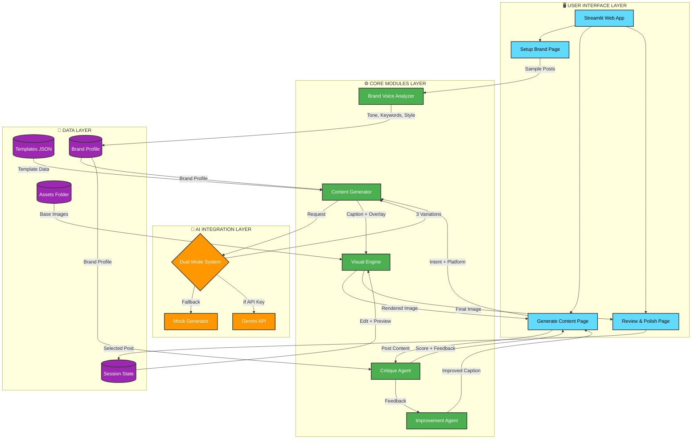

# 🏗️ AI Social Media Agent - Architecture Diagram

## High-Level System Architecture



## Component Details

### 🖥️ User Interface Layer
| Component | Purpose |
|-----------|---------|
| **Setup Brand** | Collects sample posts and displays extracted brand voice |
| **Generate Content** | Creates 3 post variations with images and critique loop |
| **Review & Polish** | Manual editing, live preview, and export |

### ⚙️ Core Modules Layer
| Module | Input | Output |
|--------|-------|--------|
| **Brand Voice Analyzer** | Sample posts | Tone, keywords, visual style |
| **Content Generator** | Intent + platform + brand profile | 3 caption variations + overlay text |
| **Visual Engine** | Base image + overlay + brand style | Rendered social media image |
| **Critique Agent** | Post content + brand profile | Score (1-10) + feedback |
| **Improvement Agent** | Caption + feedback | Improved caption |

### 🤖 AI Integration Layer
```
┌─────────────────────────────┐
│   Dual Mode System          │
├─────────────────────────────┤
│ IF API Key Present:         │
│   → Use Gemini API          │
│ ELSE:                       │
│   → Use Mock Generator      │
└─────────────────────────────┘
```

**Mock Generator Features:**
- ✅ Template-based generation
- ✅ Platform-specific rules
- ✅ Smart text processing
- ✅ Zero latency

**Gemini API Features:**
- ✅ Creative, unique content
- ✅ Context-aware generation
- ✅ Advanced critique feedback

### 💾 Data Layer
| Storage | Contents |
|---------|----------|
| **Templates JSON** | Post template definitions (Announcement, Product Launch, Meme, etc.) |
| **Assets Folder** | Base images for different post types |
| **Brand Profile** | Extracted tone, keywords, visual style (color, font) |
| **Session State** | Generated posts, critique results, user selections |

## Data Flow Diagram

```
┌──────────────┐
│ User Input   │
│ (3 samples)  │
└──────┬───────┘
       │
       ▼
┌──────────────────────┐
│ Brand Voice Extract  │
│ • Tone Analysis      │
│ • Keyword Frequency  │
│ • Style Inference    │
└──────┬───────────────┘
       │
       ▼
┌──────────────────────┐
│ Content Generation   │
│ • 3 Variations       │
│ • Platform Rules     │
│ • Overlay Text       │
└──────┬───────────────┘
       │
       ▼
┌──────────────────────┐
│ Visual Rendering     │
│ • Text Overlay       │
│ • Brand Colors       │
│ • Auto Wrapping      │
└──────┬───────────────┘
       │
       ▼
┌──────────────────────┐
│ Critique Loop        │
│ • Score Post         │
│ • Generate Feedback  │
│ • Apply Improvements │
└──────┬───────────────┘
       │
       ▼
┌──────────────────────┐
│ Human Review         │
│ • Manual Edit        │
│ • Live Preview       │
│ • Export Image       │
└──────────────────────┘
```

## Technology Stack

```
Frontend:     Streamlit 1.31.0
Image Processing: Pillow 10.2.0
AI (Optional):    Google Gemini API
Language:     Python 3.8+
Deployment:   Streamlit Cloud (Free)
```

## Key Design Patterns

1. **Dual-Mode Architecture**: Graceful fallback from AI to Mock
2. **Session State Management**: Persistent data across page navigation
3. **Modular Design**: Separation of concerns (UI, Logic, Data)
4. **Caching Strategy**: `@st.cache_data` for expensive operations
5. **Error Handling**: Try-catch with user-friendly error messages

---

**Built for Hack-Nation 2026 Challenge 12** 🏆
